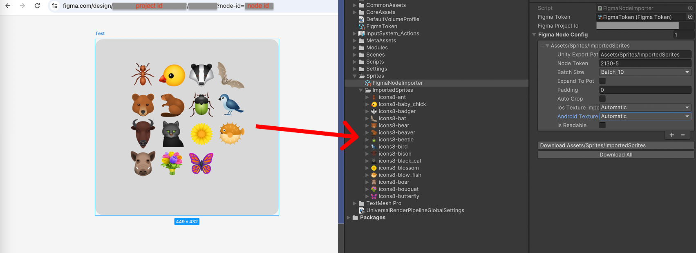

# Figma to Unity importer
Simple tool for importing images from Figma to Unity. Download images from given Figma file and save them to the specified folder.

## Install
Add git package https://github.com/vadim-agamov/figma-importer.git to Package Manager
## Configuration
### Figma API token
Add [personal access token](https://help.figma.com/hc/en-us/articles/8085703771159-Manage-personal-access-tokens): Create -> FigmaImporter -> Token.  
___Do not forget to exclude token from public repository___
### Import settings
Create config with import settings.  Create -> FigmaImporter -> Node Importer
- *Figma Project Id* - id of the Figma project
- *Figma Token* - reference to figma token config
- *Unity Export Path* - path to the folder where images will be saved in Unity project starting from Assets folder: _Assets/.._
- *Node Token* - token of the node that holds images you want to import
- *Batch size* - number of images to download in one request. Figma API could return error in case you request of too many images at once
- *Ios Texture Importer*,*Android Texture Importer* - texture import format
### Post Processing
- *Expand to Pot* - increase image size to nearest power of two
- *Padding* - amount of pixels to add around the image
- *Auto crop* - crop image to the non-transparent content area
- *ResizeTo* - set image size to the specified value and copy image to the center
## Usage
Locate config in inspector and press "Download" / "Download All" button
